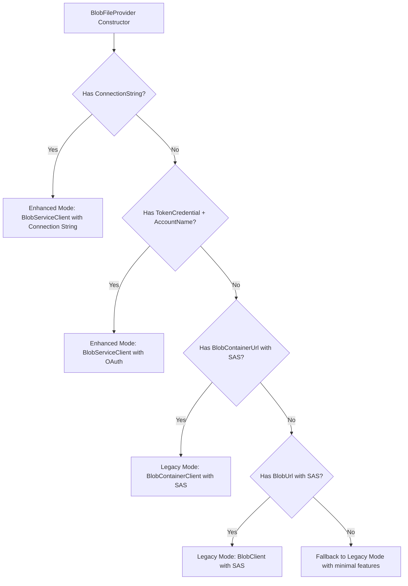

# BlobConfigurationProvider
A .NET Configuration Provider using JSON settings from an Azure Blob Storage with enhanced change detection strategies and comprehensive validation.

## 🔐 Authentication & Credentials

The BlobConfigurationProvider supports multiple authentication methods through a flexible factory pattern. Each factory handles authentication differently based on the type of Azure Storage client it creates.

### Factory Architecture Overview

| **Factory Type** | **Handles** | **Authentication Method** | **Used For** |
|------------------|-------------|---------------------------|--------------|
| **`BlobServiceClientFactory`** | Connection strings, TokenCredential | Built-in auth, OAuth/Managed Identity | **Enhanced Mode** (advanced features) |
| **`BlobContainerClientFactory`** | Container URLs with SAS tokens | SAS embedded in URL | **Legacy Mode** (SAS-based) |
| **`BlobClientFactory`** | Individual blob URLs with SAS | SAS embedded in URL | **Legacy Mode** (direct blob access) |

### Authentication Methods

#### 1. **TokenCredential-Based (Recommended - Enhanced Mode)**

```csharp
using Azure.Identity;

// Explicit credential control
builder.Configuration.AddJsonBlob(config => 
{
    config.AccountName = "mystorageaccount";
    config.ContainerName = "configuration";
    config.BlobName = "appsettings.json";
}, logger, new DefaultAzureCredential());

// Or with specific credentials
builder.Configuration.AddJsonBlob(config => 
{
    // ...configuration...
}, logger, new ManagedIdentityCredential());
```

#### 2. **Environment-Based Credentials (Enhanced Mode)**

```csharp
// Automatically selects credential based on environment variables
builder.Configuration.AddJsonBlobWithEnvironmentCredentials(config => 
{
    config.AccountName = "mystorageaccount";
    config.ContainerName = "configuration";  
    config.BlobName = "appsettings.json";
}, logger);
```

**Environment Variable Support:**
- `AZURE_CLIENT_ID` + `AZURE_CLIENT_SECRET` + `AZURE_TENANT_ID` → **`ClientSecretCredential`**
- `AZURE_CLIENT_ID` only → **`ManagedIdentityCredential`** with client ID
- Neither → **`DefaultAzureCredential`** (tries multiple sources)

#### 3. **Configuration-Based Credentials (Enhanced Mode)**

```csharp
// Reads credentials from IConfiguration
builder.Configuration.AddJsonBlobWithConfiguredCredentials(config => 
{
    config.AccountName = "mystorageaccount"; 
    config.ContainerName = "configuration";
    config.BlobName = "appsettings.json";
}, logger, builder.Configuration);
```

**Configuration Format:**
```json
{
  "Azure": {
    "ClientId": "your-client-id",
    "ClientSecret": "your-client-secret", 
    "TenantId": "your-tenant-id",
    "CredentialChain": ["managedidentity", "azurecli", "visualstudio"]
  }
}
```

#### 4. **Connection String (Enhanced Mode)**

```csharp
builder.Configuration.AddJsonBlob(config => 
{
    config.ConnectionString = "DefaultEndpointsProtocol=https;AccountName=mystorageaccount;AccountKey=...";
    config.ContainerName = "configuration";
    config.BlobName = "appsettings.json";
}, logger, new DefaultAzureCredential()); // Credential still required for API consistency
```

#### 5. **SAS URLs (Legacy Mode - Automatic Fallback)**

```csharp
builder.Configuration.AddJsonBlob(config => 
{
    // Container-level SAS
    config.BlobContainerUrl = "https://mystorageaccount.blob.core.windows.net/config?sv=2021-06-08&se=...";
    config.BlobName = "appsettings.json";
    
    // OR blob-level SAS
    config.BlobUrl = "https://mystorageaccount.blob.core.windows.net/config/appsettings.json?sv=2021-06-08&se=...";
}, logger, new DefaultAzureCredential());
```

### Authentication Flow

The `BlobFileProvider` uses a **waterfall approach** to determine which authentication method to use:



### Enhanced vs Legacy Mode

| **Mode** | **Features** | **Authentication** | **Performance** |
|----------|--------------|-------------------|-----------------|
| **Enhanced** | Content-based change detection, debouncing, advanced caching | TokenCredential, Connection String | Optimized polling, intelligent strategies |
| **Legacy** | Basic ETag-based detection | SAS URLs only | Simple polling, basic caching |

### Security Best Practices

#### ✅ **Recommended (Enhanced Mode)**
```csharp
// Production: Managed Identity
builder.Configuration.AddJsonBlob(config => { 
    config.AccountName = "prodstorageaccount";
    // ...
}, logger, new ManagedIdentityCredential());

// Development: Environment-based
builder.Configuration.AddJsonBlobWithEnvironmentCredentials(config => {
    config.AccountName = "devstorageaccount"; 
    // ...
}, logger);
```

#### ⚠️ **Use with Caution**
```csharp
// Connection strings contain secrets - use Key Vault or environment variables
config.ConnectionString = builder.Configuration.GetConnectionString("BlobStorage");

// SAS URLs have limited lifetime - ensure automatic renewal
config.BlobContainerUrl = builder.Configuration["BlobStorage:ContainerUrl"];
```

#### ❌ **Avoid**
```csharp
// Hard-coded secrets in source code
config.ConnectionString = "DefaultEndpointsProtocol=https;AccountName=...;AccountKey=hardcoded...";
```

### Common Authentication Scenarios

#### **Azure App Service**
```csharp
// Enable Managed Identity in portal, then:
builder.Configuration.AddJsonBlob(config => 
{
    config.AccountName = "mystorageaccount";
    config.ContainerName = "configuration";
    config.BlobName = "appsettings.json";
}, logger, new ManagedIdentityCredential());
```

#### **Azure Container Apps/AKS**
```csharp
// With Workload Identity or Pod Identity:
builder.Configuration.AddJsonBlobWithEnvironmentCredentials(config => 
{
    // Environment variables set by Azure infrastructure
    config.AccountName = Environment.GetEnvironmentVariable("STORAGE_ACCOUNT_NAME");
    config.ContainerName = "configuration";
    config.BlobName = "appsettings.json"; 
}, logger);
```

#### **Local Development**
```csharp
// Uses Azure CLI, Visual Studio, or environment variables automatically:
builder.Configuration.AddJsonBlobWithEnvironmentCredentials(config => 
{
    config.AccountName = "devstorageaccount";
    config.ContainerName = "configuration";
    config.BlobName = "appsettings.json";
}, logger);
```

#### **CI/CD Pipelines**
```csharp
// Service Principal via environment variables:
// AZURE_CLIENT_ID=your-sp-client-id
// AZURE_CLIENT_SECRET=your-sp-secret  
// AZURE_TENANT_ID=your-tenant-id

builder.Configuration.AddJsonBlobWithEnvironmentCredentials(config => 
{
    config.AccountName = "storageaccount";
    config.ContainerName = "configuration";
    config.BlobName = "appsettings.json";
}, logger);
```

## 🛡️ Configuration Validation

All timing and size configuration values are validated using .NET DataAnnotations with descriptive error messages:

### Validation Ranges (Enforced via Range Attributes)
- **ReloadInterval**: 1000-86400000 ms (1s to 24h)
- **DebounceDelay**: 0s-1h (TimeSpan) - 0 disables debouncing  
- **WatchingInterval**: 1s-24h (TimeSpan) - allows fast polling
- **ErrorRetryDelay**: 1s-2h (TimeSpan) - allows quick retries
- **MaxFileContentHashSizeMb**: 1-1024 MB

### Validation Sources
The primary validation ranges are expressed via `[Range]` attributes on the `BlobConfigurationOptions` properties and enforced at startup using `Validator.TryValidateObject()`. In addition, `BlobFileProvider.ValidateConfiguration` performs extra runtime guard checks (for example, on `TimeSpan` values) and may emit its own, more specific error messages when an invalid configuration slips through.

### Example Validation Error
```csharp
// ❌ This will throw ArgumentException with clear error messages
builder.Configuration.AddJsonBlob(config => 
{
    config.DebounceDelay = TimeSpan.FromSeconds(-5);        // Invalid: negative value
    config.WatchingInterval = TimeSpan.Zero;                // Invalid: must be >= 1s  
    config.ErrorRetryDelay = TimeSpan.FromHours(3);         // Invalid: too large (>2h)
}, logger);

// Error: "Invalid BlobConfiguration values:
// DebounceDelay must be between 0 seconds and 1 hour. Use 0 to disable debouncing.
// WatchingInterval must be between 1 second and 24 hours.  
// ErrorRetryDelay must be between 1 second and 2 hours."
```

### Valid Configuration Examples
```csharp
// ✅ Production configuration
builder.Configuration.AddJsonBlob(config => 
{
    config.DebounceDelay = TimeSpan.FromSeconds(30);        // Recommended for production
    config.WatchingInterval = TimeSpan.FromSeconds(60);     // Balanced polling  
    config.ErrorRetryDelay = TimeSpan.FromSeconds(120);     // Conservative retry
    config.MaxFileContentHashSizeMb = 5;     
}, logger);

// ✅ Test/development configuration
builder.Configuration.AddJsonBlob(config => 
{
    config.ReloadInterval = 1000;                           // Fast for tests (1 second)
    config.DebounceDelay = TimeSpan.Zero;                   // Disabled debouncing
    config.WatchingInterval = TimeSpan.FromSeconds(1);      // Fast polling
    config.ErrorRetryDelay = TimeSpan.FromSeconds(1);       // Quick retry
}, logger);
```
